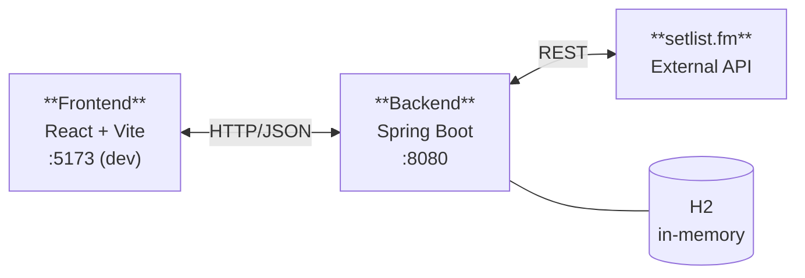

# Architecture

> Three-layer system: React frontend → Spring Boot backend → setlist.fm external API.

---

## System diagram



The frontend never calls setlist.fm directly. All external traffic goes through the backend.

---

## Backend layers

| Package | Role |
|---------|------|
| `api/controller` | REST controllers — maps HTTP to service calls |
| `api/dto` | Request and response shapes — validated with Bean Validation |
| `api/exception` | `GlobalExceptionHandler` + typed exceptions (`NotFoundException`, `ConflictException`, `ExternalServiceException`) |
| `service` | Business logic — `UserService`, `FavoriteService`, `ArtistService` |
| `domain/entity` | JPA entities — `User`, `Artist`, `Favorite` |
| `domain/repository` | Spring Data repositories |
| `adapter/setlistfm` | HTTP client for setlist.fm, response models, config |
| `config` | CORS configuration |

---

## Domain model

```
User ──< Favorite >── Artist
```

- **User** — username + email, no auth
- **Artist** — fetched from setlist.fm on first request, then cached by `mbid`
- **Favorite** — join between one user and one artist, with an optional note and a creation timestamp

The `(user_id, artist_id)` pair has a unique constraint — a user can only favorite an artist once.

---

## Tech stack

| Layer | Technology |
|-------|------------|
| Backend | Java 21, Spring Boot 4, Maven |
| Persistence | Spring Data JPA, H2 (in-memory) |
| Validation | Bean Validation (`@Valid`) |
| API docs | springdoc-openapi (Swagger UI) |
| Frontend | React 19, Vite, React Router |
| External API | setlist.fm REST API v1.0 |