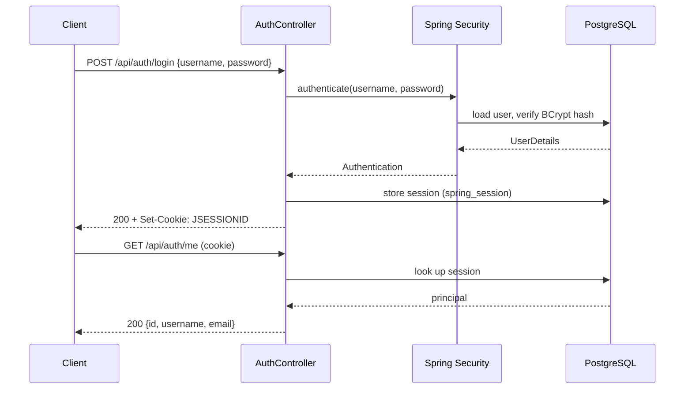

# Security

> How authentication, sessions, and authorization work in Stagefinder.

---

## Authentication

Stagefinder uses **HTTP session authentication** — no JWTs, no API tokens. A successful login stores the authenticated principal in a server-side session backed by PostgreSQL (`spring_session` table). The client receives a `JSESSIONID` cookie.

---

## Passwords

Passwords are hashed with **BCrypt** (cost factor 10) before being stored. The plaintext password is never persisted.

---

## Session storage

Sessions are stored in PostgreSQL via Spring Session JDBC. The schema (`spring_session`, `spring_session_attributes`) is created automatically by Spring on startup.

Sessions expire after **24 hours** of inactivity. The `JSESSIONID` cookie is:

- `HttpOnly` — not accessible to JavaScript
- `SameSite=Strict` — not sent on cross-site requests

---

## CSRF

CSRF tokens are disabled. `SameSite=Strict` on the session cookie prevents cross-site requests from carrying the session, which eliminates the CSRF attack vector for browsers that enforce the `SameSite` attribute.

---

## Authorization

Ownership is enforced at the service layer, not just at the routing level.

| Endpoint group | Who can access |
|---------------|----------------|
| `POST /api/users` | Anyone (registration) |
| `GET /api/users/{id}` | Any authenticated user |
| `PUT/DELETE /api/users/{id}` | The owner only |
| `/api/users/{userId}/favorites/**` | The owner only |
| `/api/setlists/**` | Anyone |
| `/api/auth/**` | Anyone |

Unauthenticated requests to protected endpoints receive `401 Unauthorized`.  
Authenticated requests to another user's resources receive `403 Forbidden`.
